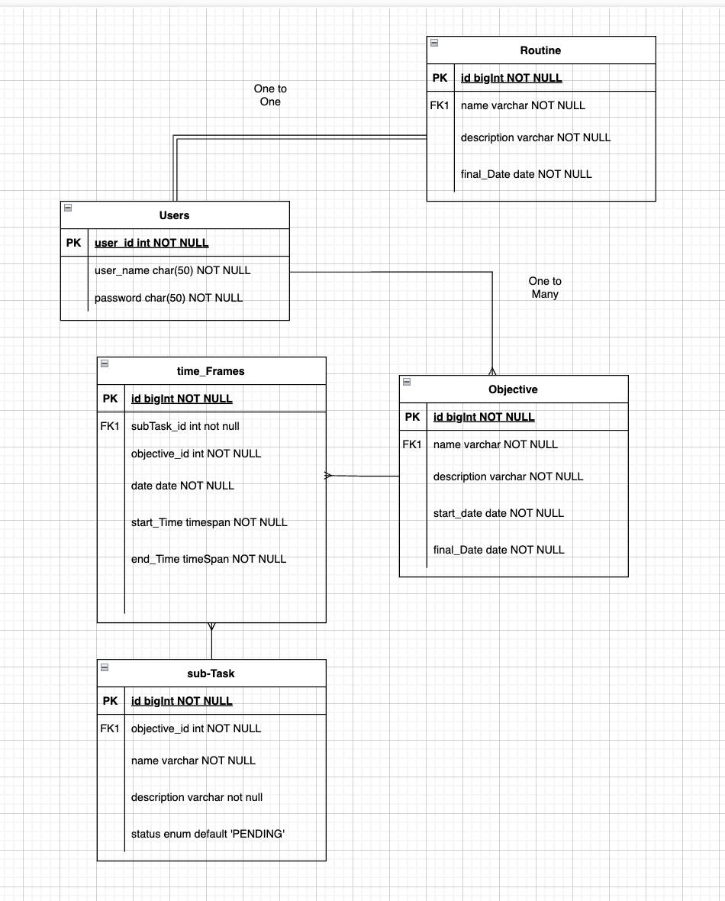

# Goal Management System

This application allows users to manage their time efficiently, along with setting goals and steps to achieving them.

## Features:
### Set a base routine
- Work time, Lunch, etc. 

### Set an Objecive
- Set subtasks for the objective (give visual feedback on completion)
- Display a motivation quote pulled from an API at user defined intervals
- Notify when you should start doing subtask

## Tech Stack
### Front-end
- React
- TanStack Router/Query
- Mui
- Shadcn
- Tailwind CSS

### Back-end
- Spring Boot
- JWT 
- PostgreSQL

## ERD model

## API integrations

Few api that we will be using in our application are:
 - ImprovMX - email notification upon task completion, or upcoming task
 - Zenquotes.io - supply randomized quotes

## Deployment
- AWS
- Jenkins